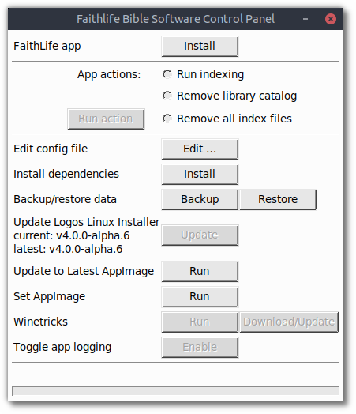

# Manual testing results

## Optarg testing

| Optargs | latest version tested | result |
| :--- | :--- | :---: |
| `-v/--version` | `4.0.0-alpha.6` | :+1: |
| `-F/--skip-fonts` | `4.0.0-alpha.6` | :+1: |
| `-a/--check-for-updates` | | |
| `-K/--skip-dependencies` | `4.0.0-alpha.6` | :+1: |
| `-V/--verbose` | `4.0.0-alpha.6` | :+1: |
| `-D/--debug` | `4.0.0-alpha.6` | :+1: |
| `-c/--config` | | |
| `-f/--force-root` | | |
| `-p/--custom-binary-path` | | |
| `-L/--delete-log` | `4.0.0-alpha.6` | :+1: |
| `-P/--passive` | `4.0.0-alpha.6` | :+1: |
| `--install-app` | `4.0.0-alpha.6` | :+1: |
| `--run-installed-app` | `4.0.0-alpha.6` | :+1: |
| `--run-indexing` | | |
| `--remove-library-catalog` | | |
| `--remove-index-files` | | |
| `--edit-config` | `4.0.0-alpha.6` | :+1: |
| `--install-dependencies` | | |
| `--backup` | | |
| `--restore` | | |
| `--update-self` | | |
| `--update-latest-appimage` | | |
| `--set-appimage` | | |
| `--get-winetricks` | | |
| `--run-winetricks` | `4.0.0-alpha.6` | :+1: |
| `--toggle-app-logging` | `4.0.0-alpha.6` | :+1: |
| `--create-shortcuts` | | |
| `--remove-install-dir` | `4.0.0-alpha.6` | :+1: |
| `--dirlink` | | |
| `--check-resources` | | |

## TUI testing

## GUI testing

| Button/Action | latest version tested | result |
| :--- | :--- | :---: |
| Install [app] | `4.0.0-alpha.6` | :+1: |
| Run app | `4.0.0-alpha.6` | :+1: |
| Run indexing |||
| Remove library catalog |||
| Remove all index files |||
| Edit... [config file] | `4.0.0-alpha.6` | :+1: |
| Install [dependencies] |||
| Backup |||
| Restore |||
| [Self-]Update |||
| Run [Update to Latest AppImage] |||
| Run [Set AppImage] |||
| Run [Winetricks] | `4.0.0-alpha.6` | :+1: |
| Download/Update [Winetricks] |||
| Enable/Disable [app logging] |||
